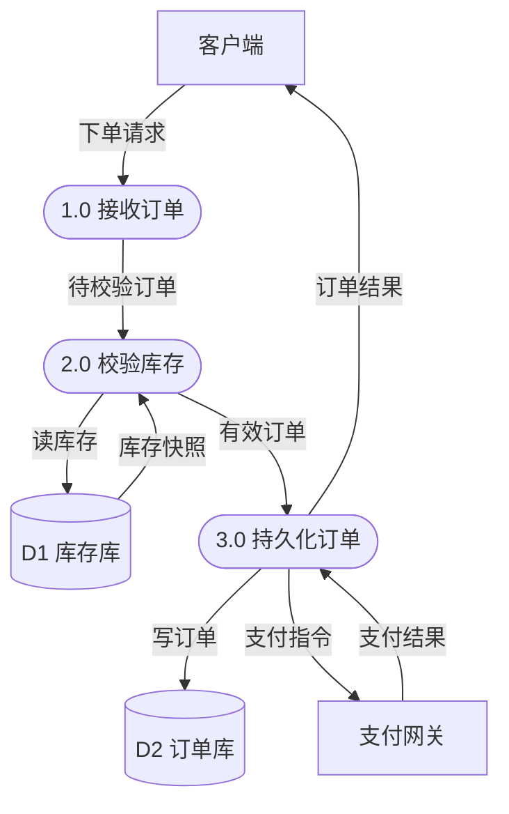

# Mermaid 架构数据流图案

飞书与本地 Markdown **共用**下列写法。飞书会把 `mermaid` 代码块转为画板。

## 形状映射（Gane-Sarson → Mermaid）

```text
外部实体  E["名称"]           矩形
加工      P(["编号 动词短语"]) 圆角/スタジアム
存储      D[("D编号 名称")]   圆柱
数据流    A -->|"数据名"| B
```

## 硬性语法

- 所有中文或非 ASCII 标签用双引号：`E1["前端"]`、`|"订单请求"|`
- 节点 ID 用 ASCII：`E1` `P0` `P1` `D1`
- 优先 `flowchart LR`（Level 0）或 `flowchart TB`（Level 1）；复杂时 TB
- 不要用 `sequenceDiagram` 冒充数据流图

## Level 0 示例

````markdown

````

## Level 1 示例

````markdown

````

## 布局建议

- 外部实体靠左/右侧；加工居中；存储靠近读写它的加工
- 避免交叉：宁可加长折线语义清晰，也不要无标签
- 异步流可在标签加前缀：`|"异步: 订单已创建事件"|`

## 飞书注意

- 仅围栏 ` ```mermaid ` … ` ``` `，不要包在 callout 里（callout 不支持代码块）
- 创建后可用返回的 `board_tokens`；核对画板可用 `fetch-file`（`resource_type: whiteboard`）
- 渲染失败时优先检查：未加引号的中文、节点 ID 含特殊字符、标签含未转义的 `"`
