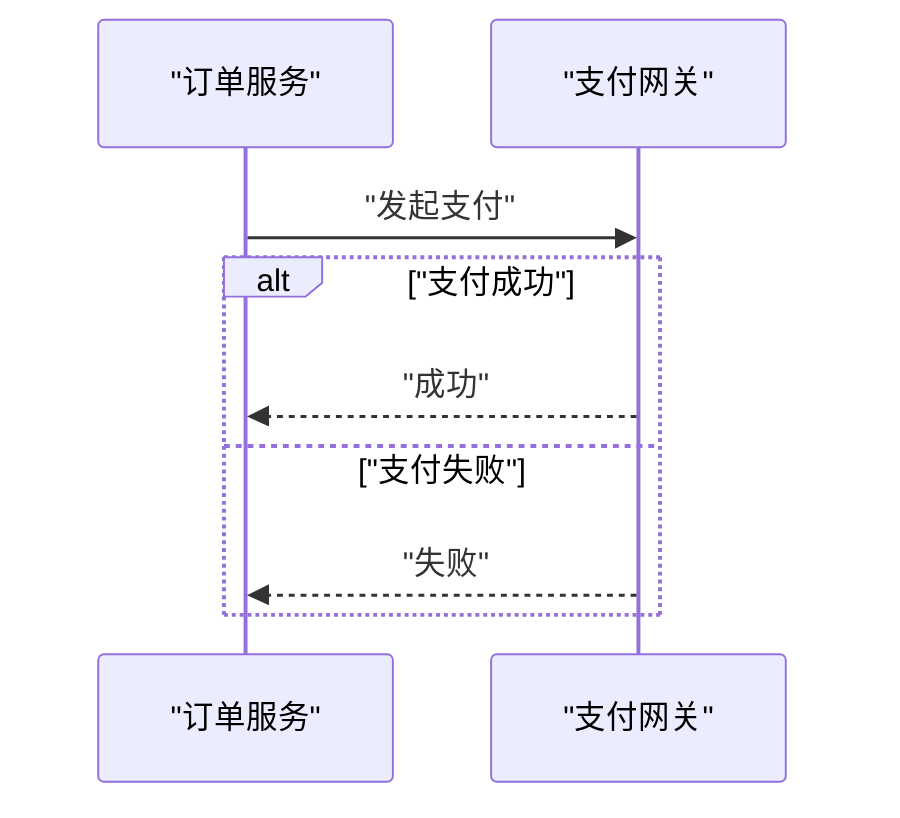
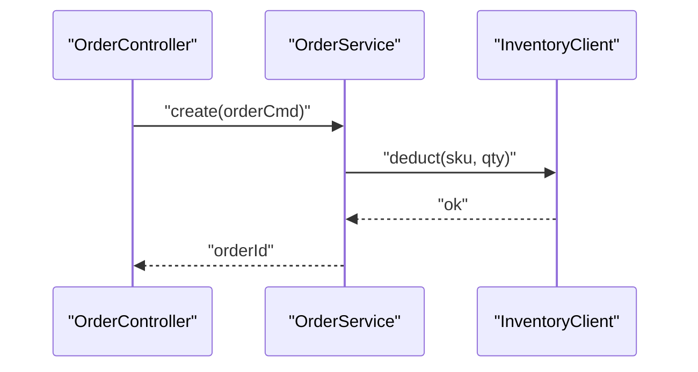

# Mermaid 架构时序图案

飞书与本地 Markdown **共用**下列写法。飞书会把 `mermaid` 代码块转为画板。

## 基础语法

```text
sequenceDiagram
  actor U as "用户"
  participant G as "API网关"
  participant O as "订单服务"
  participant D as "订单库"
  participant P as "支付网关"

  U->>G: "提交下单"
  G->>O: "创建订单"
  O->>D: "插入订单"
  D-->>O: "ok"
  O->>P: "发起支付"
  P-->>O: "支付单号"
  O-->>G: "下单结果"
  G-->>U: "下单结果"
```

## 箭头

| 语义 | 语法 |
|------|------|
| 同步请求 | `A->>B: "msg"` |
| 返回 | `B-->>A: "msg"` |
| 异步 | `A-)B: "异步: event"` |

## 片段（按需）

主成功默认不用。用户要求异常/可选逻辑时：

````markdown

````

`opt`（可选）、`loop`（重试/轮询）、`par`（并行）同理；主成功图优先直线流程。

## 硬性语法

- 中文/非 ASCII 的 participant 别名与消息文本用双引号
- participant/actor 的 ID 用 ASCII：`U` `G` `O1`
- 使用 `sequenceDiagram`，不要用 `flowchart` 冒充时序
- 不要包在飞书 callout 里（callout 不支持代码块）

## 细化到类/方法示例

````markdown

````

仅展开关键链；同图中其他系统仍可用组件级 participant。

## 飞书注意

- 围栏 `mermaid`；创建后可用 `board_tokens`
- 核对画板：`fetch-file`，`resource_type: whiteboard`
- 失败时优先查：中文未加引号、消息含未转义 `"`
